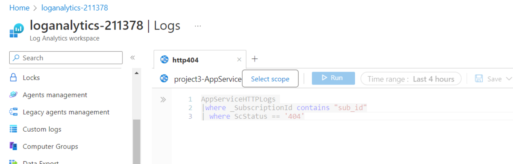

# Project3
 **Introduction**
 
In Project3, Azure DevOps is used to build a CI/CD pipeline that create and deploy infrastructure with the help of Terraform. The Azure App Service is used to host a website – FakeRestAPI. For this particular project, a Linux Virtual machine is deployed, and for the configuration with Udacity Lab, a personal access Token was generated, a self hosted pool and an agent were created, also a manual service connection. Using this infrastructure, automated tests are run: UI test with Selenium, integration test with Postman, endurance and stress test with JMeter.
 
 **Project dependencies**
 
 [Terraform](https://www.terraform.io/downloads)
 
 [JMeter](https://jmeter.apache.org/download_jmeter.cgi)
 
 [Postman](https://www.postman.com/downloads/)
 
 [Python](https://www.python.org/downloads/)
 
 [Selenium](https://sites.google.com/a/chromium.org/chromedriver/getting-started)
 
 **Prerequisites**
 
 [Azure Account](https://portal.azure.com/)
 
 [Azure Command Line Interface](https://docs.microsoft.com/en-us/cli/azure/install-azure-cli?view=azure-cli-latest)
 
 [Azure DevOps Account](https://dev.azure.com/)
 
 **Steps**
 
1.	Download the Project starter directory gived by Udacity.
2.	Open it in your code editor (for exemple VS Code)
3.	Login to your Azure account: `az login`
4.	Create service principal or use the one you already have:

`az ad sp create-for-rbac --name ensuring-quality-releases-sp --role="Contributor" --scopes="/subscriptions/SUBSCRIPTION_ID"`

5.	Previous command will display appID, displayName, name, password and tenant, save this informations somewhere, you will need them later.
6. cd in terraform and run: `bash config.sh`, save dispalyed information.
7. Create an azsecret.conf which will contains variables to be uploaded and used in you pipline as group variables, azsecret.conf will contain: 
   - storage_account_name
   - container_name
   - key
   - access_key
   - subscription_id
   - client_id
   - client_secret
   - tenant_id
!! All saved information will be used in azsecret.
8. Go to you local terminal and create SSH key, a private key and a public key will be saved in your ssh file on the computer:

   `cd ~/.ssh/`

   `ssh-keygen -t rsa -b 4096 -f az_eqr_id_rsa`

   `cat  az_eqr_id_rsa.pub` 

!!! Save the ssh key somehere, it will be necessary later in the pipeline.

**Steps to be followed with Udacity Lab**
9. In the Azure Portal, create a VM, in the resource group Azuredevops and with the same location.
10. Add necessaries information to you terraform.tvars 
!!! Again, same resource group use to create the backend state and container, and same location.

11. Create a new repo and push your code to GitHub.
12. Head over to Azure DevOps Organization and login to your organization.
13. Create a new organization (for Udacity Lab, all information are pre-completed).
14. For Udacity Lab, create PAT, save the token key somewhere, you will use later.
15. For Udacity Lab, create manual Service Connection.
16. Create a new agent pool. 

  - login on the VM
  
  - download: `curl -O https://vstsagentpackage.azureedge.net/agent/2.202.1/vsts-agent-linux-x64-2.202.1.tar.gz`
  
  - create and cd into the agent: `mkdir myagent && cd myagent`
  
  - unzip: `tar zxvf ../vsts-agent-linux-x64-2.202.1.tar.gz`
  
17. Configure the agent

  - `./config.sh` to run the configuration
  
  - `sudo ./svc.sh install` to install SVC
  
  - `sudo ./svc.sh start` to start the VM
  
 18. Also, in the Azure Dev Ops, create an environment and install in the created VM.
 19. Also, in the Azure Dev Ops, install Terraform from marketplace.
 20. In Library, add secure files and upload azsecret and ssh key that you have generated.
 21. Add variable at the point of deploying the yaml file.
 22. Before running the pipeline, you need to install below on your VM 

  `sudo apt-get -y install zip to install ZIP`
  
  `curl -sL https://aka.ms/InstallAzureCLIDeb | sudo bash to install Azure CLI`
  
  `sudo apt-get install npm to install NPM`
  
 23. Deploy your yaml file.
 
 **INFRASTRUCTURE**
 
 **Terraform**
 
 
 
 
 **Deployed Webapp**
 
 
 
 **Successful execution of the pipeline**
 
 
 
 **TESTING**
 
 Regression test
 
 
 Validation test
 
 
 Publish test result
 
 
 
 
 
 24. Move to Azure Portal, from Azure Portal inside the Azure Devops resource group, for Udacity Lab, we have a LAW created.
 - install the agent - ssh into the Linux agent created (myLinuxAgent)
 - go to Agents Management > Linux server > Log Analytics Agent instructions > Download and onboard agent for Linux
 25. Create a new alert for the App Service
 
   a) From the Azure Portal go to:
      `Home > Resource groups > "RESOURCE_GROUP_NAME" > "App Service Name" > Monitoring > Alerts`
   b) Click on `Create alert rule`
   c) Verify that you create for the correct ressource.
   d) Under `Condition` > click `Add condition`
   d) Choose a condition e.g. `Http 404`
   e) Set the `Threshold value` to e.g. `1`. 
   f) Click `Done`
  
 26. Create a new action group for the App Service

   a) In the same page, go to the `Actions` section, click `Add action groups` and then `Create action group`.
   b) Give the action group a name e.g. `http404`
   c) Add an Action name e.g. `HTTP 404` and choose `Email/SMS message/Push/Voice` in `Action Type`.
   d) Provide your email and then click `OK`

 27. Create AppServiceHTTPLogs

   - go to the `App service > Diagnostic Settings` > Add `Diagnostic Setting`, select `AppServiceHTTPLogs` and Send to Log Analytics Workspace > `Save`.
   - go back to the `App service > App Service Logs`. Turn on `Detailed Error Messages` and `Failed Request Tracing` > `Save`. Restart the app service.

 28. Setting up Log Analytics

   - set up custom logging, in the log analytics workspace go to `Settings > Custom Logs > Add + > Choose File`. 
   - select the file `selenium.log > Next > Next`. 
   - put the following paths for Linux: `/var/log/selenium/selenium.log`.
   - select the box `Apply below configuration to my Linux machines`.
   - go back to Log Analytics workspace and run below query to see Logs

  `AppServiceHTTPLogs 
  |where _SubscriptionId contains "sub_id"
  | where ScStatus == '404'`
  
  
  

   - go back to the App Service web page and navigate on the link, and generate 404 not found error, example:
   https://project3-appservice.azurewebsites.net/sheeeeee
   
   Trrigered email
   
   

 
